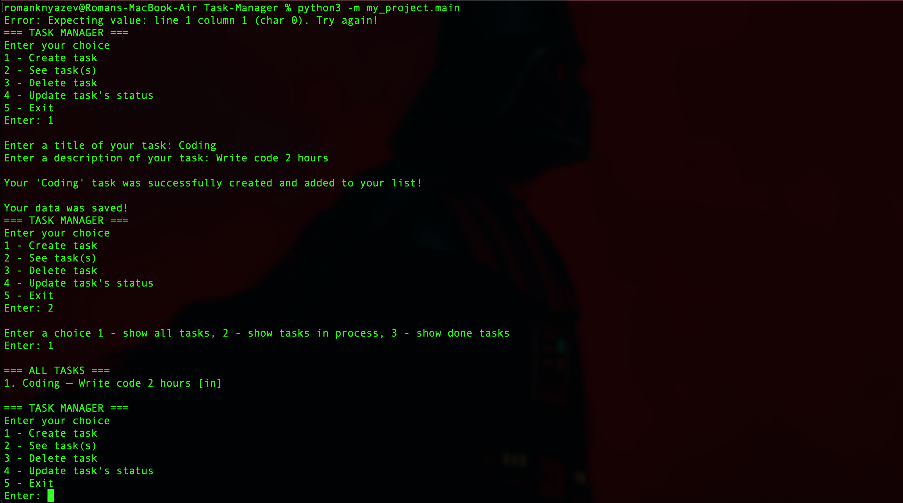
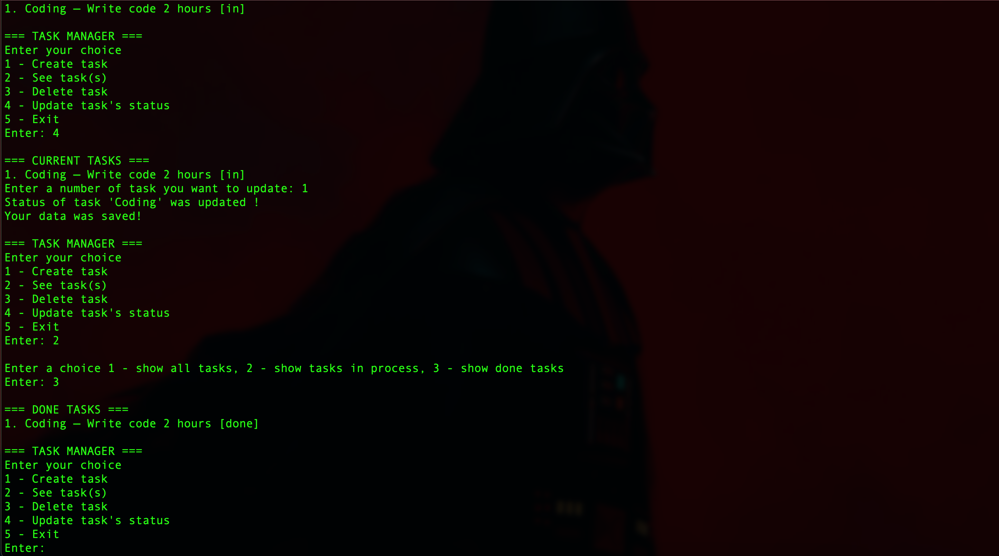
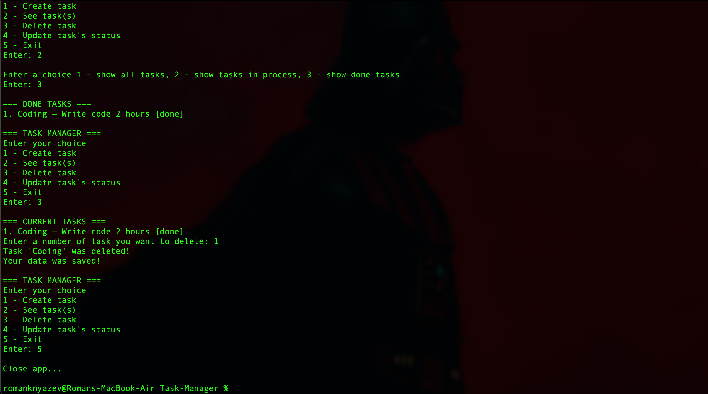

# Task-Manager

# 📝 Console Task Manager (CRUD)

---

## 📺 Demo

## 

## 

## 

## ✨ Features

- **Full CRUD Lifecycle:** Create, Read (with filtering), Update status, and Delete tasks.
- **Robust Input Validation:** Prevents empty data or overly long titles (>25 symbols).
- **Persistent Storage:** Automaticaly saves your list into `data/database.json`.
- **Clean UI:** Highly structured terminal output with visible boundaries for different task views.

---

## 🚀 How to Run

### Prerequisites

Make sure you have Python 3.10 or higher installed.

### Installation & Execution

1. Clone this repository:

   ```bash
   git clone https://github.com
   cd Task-Manager
   ```

2. Run the application from the root directory using module notation:
   ```bash
   python3 -m my_project.main
   ```

---

## 📂 Project Structure

```text
Task-Manager/
│
├── my_project/
│   ├── __init__.py
│   ├── main.py                # Application entry point
│   │
│   ├── core/
│   │   ├── __init__.py
│   │   └── main_logic.py      # CLI Menu loop and user interactions
│   │
│   └── models/
│       ├── __init__.py
│       └── task.py            # Task and TaskManager classes (Business logic)
│
├── data/
│   └── database.json          # Persistent JSON storage (Auto-generated)
│
└── README.md
```

---

## 🗺️ Roadmap / Future Updates

- After I learn SQL I have a plan to change save system to SQLite or PostgreSQL

---

License: MIT
